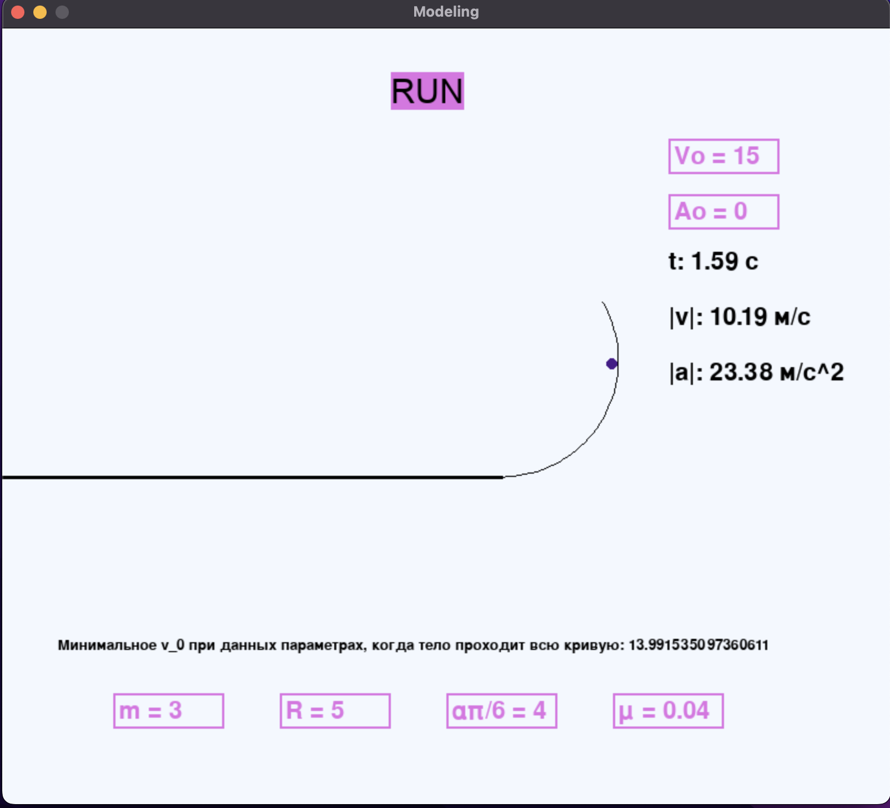

# Мертвая петля

 Тело массой $m$ разгоняется в горизонтальной плоскости и попадает на вертикально расположенный фрагмент кольца(дугу) радиуса R и угловым размером $\alpha (\frac{\pi}{2} <= a<=\frac{3\pi}{2})$. Определить начальную скорость тела, необходимую для прохождения всей длины дуги. Построить(визуализировать) траекторию тела после отрыва от дуги. Дуга имеет коэффициент трения $\mu$. Программа должна предусматривать изменение параметров, приведенных ниже. \

Масса тела $m = 3$, кг \
Радиус кольца R = 5 м\
Угловой размер дуги $\alpha = \frac{\pi}{2} + \frac{\pi}{6}$ рад \
Коэффициент трения  $\mu = 0.04$ \

### youtube https://youtu.be/MS3d21cEPuY

